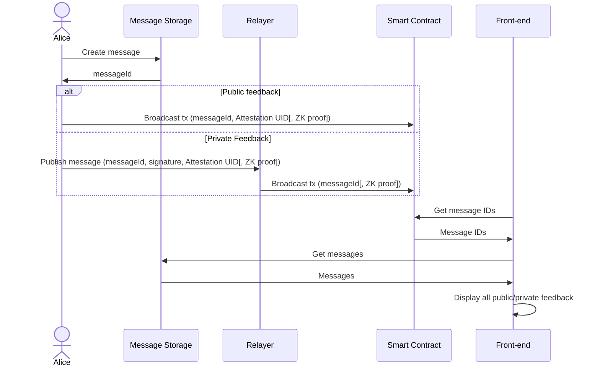
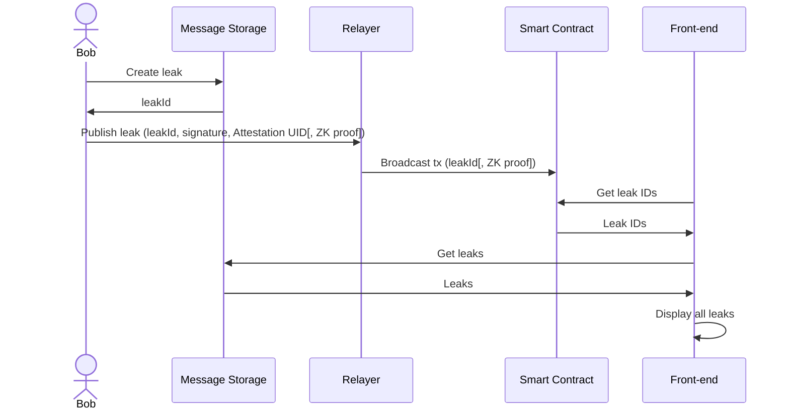

## Overview
In today's governance landscape ensuring the integrity and privacy of voting processes is paramount. This project outlines the development of a privacy-preserving voting governance application, leveraging cutting-edge technologies such as ZK proofs, Ethereum Attestation Services, and Semaphore.
Key Components
- **ZK Proofs:** Zero-Knowledge (ZK) proofs play a critical role in maintaining voter anonymity and data privacy. By enabling verifiable computation without revealing sensitive information, ZK ensures that the integrity of the voting process is upheld without compromising vote confidentiality.
- **Ethereum Attestation Services:** Ethereum Attestation Services are utilized to create a gated voting system. These services provide robust mechanisms for verifying voter eligibility while maintaining a decentralized and secure environment. Attestations serve as cryptographic proof of identity or qualification, ensuring that only authorized participants can vote.
- **Semaphore:** Semaphore is employed to allow individuals to cast verifiable votes without revealing their identities. This is crucial for preventing vote manipulation and ensuring fair outcomes.

The proof of concept we developed aimed to demonstrate that by using technologies that we mentioned, it is possible for users to vote on different proposals anonymously, without revealing the identity of the voters.

## Solution
### Identity Generation
Semaphore enables the creation of an identity on the client side using JavaScript, allowing for deterministic generation. The identity consists of three values: two secrets and one public. The public value is the identity commitment, while the two secrets are the nullifier and the trapdoor.
When a user wants to participate in the voting process, the backend receives their signature and identity commitment. The backend then validates whether the public key from the signature corresponds to a badge holder. Once validated, the identity commitment is added to a group.

### Flows
#### Enrollment Flow
User creates an Identity Commitment on the client-side, fetches their Badgeholder Attestation UID from the EAS subgraph, and submits both to the Semaphore contract (which will verify the user is in fact a Badgeholder) and if so add them to the group, which will then allow them to generate a proof for their vote.

#### Voting Flow
Once a user's Identity Commitment is added to the group and the poll has started, the user queries the contract for the group information related to the proposal they are part of. Using the group information or merkleTreeRoot, the user can generate a proof. This proof, along with the vote, is then sent to the backend to be broadcast to the Semaphore contract.

#### Vote Count Flow
Once the vote is cast, it is securely stored in an array in the Semaphore contract. The tally can be handled either by the frontend or the backend of the application. The process ensures public verifiability, as all voting events are published on-chain. This transparent method allows anyone to audit the votes and verify the integrity of the election process without compromising voters and their relations to a vote.

## Pre-requisites to Test Anon Voting

1. Have an EOA with OP ETH for gas.
2. Have a valid attestation. Addresses with valid attestations will be enabled to vote on polls where said attestation is required.

### How to issue an attestation to an address:

1. Enter [https://optimism.easscan.org/attestations](https://optimism.easscan.org/attestations)
2. Connect the wallet from which the Attestations are going to be granted (this address will have to be filled in the Anon Voting app as a valid attestation issuer)
3. Click on "Make Attestation"
4. Input `78` in the Schema input field and select `RETROPGF BADGEHOLDER`
5. Click on "Use this Schema"
6. Fill the fields with the following:
    - **Recipient:** The address that will receive the attestation
    - **RPGF ROUND :** `1`
    - **REFERRED BY :** Leave as is. (`0x0000000000000000000000000000000000000000`)
    - **REFERRED METHOD:** `referredMethod`
7. Select "On Chain"
8. Click on "Make attestation"
9. Confirm the transaction

**[Make Batch Attestations using AttestFest!](https://scribehow.com/shared/Make_Batch_attestations_using_Attest_Fest__LZn6__gDQa2fGgsahEU85A)**

## How to use Anon Voting

### Create

1. Provide a unique Poll ID
2. Set a coordinator to govern the lifecycle of the poll
3. Click on Create Poll
4. Click on Generate Identity
5. Set a desired Schema, and click on Set Schema
6. Set a valid Attester, and click on Set Attester
7. :bulb: Now the Poll is open to enrollment. Users have to enroll at this stage to be able to vote.

### Enroll to vote

1. Search for a Poll using its unique ID
2. Click on Generate Identity
3. If your address is attested under the correct Schema, you can enroll to vote.
4. Click on Enroll to vote

### Start the poll

1. Coordinator can click on Start Poll to enable voting for the enrolled users

### Vote

1. Search for a Poll using its unique ID
2. Enrolled users can only vote after the poll started
3. Generate identity
4. Select your vote and click on Cast Vote

### End the poll

1. Once the voting is completed, the coordinator can End the Poll

## For a further stage, once the POC is done and tech-related constraints and risks are mitigated

* a. Enabling private/public feedback upon proposal generation: by leveraging the same gate-keeping mechanism (EAS Attestations and Semaphore Groups), we can create a feedback system that can guarantee the person providing feedback is, in fact, allowed to do so. This can be done publicly by having the poster broadcast their own transaction including an EAS Attestation UID that can be used to check whether they are allowed to provide feedback. This can be taken a step further to only allow feedback from those who provide a zk proof of having previously enrolled to vote for the proposal.
With the use of a relayer we can make the feedback be completely private in the same way we do for casting a vote.

* b. Ability to whistleblow: by leveraging the same stack used for anonymous voting (EAS Attestations + Semaphore Groups + relayer), we can add the ability to whistleblow without revealing the identity of the whistleblower. For this the whistleblower would provide the following to the relayer: a message signed with their private key that proves they are in control of a specific address; an EAS Attestation UID issued by a trusted attester to the same address; a zk proof of having previously enrolled to vote for the proposal; the leak they wish to be made public without revealing their identity.

